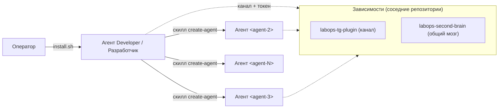
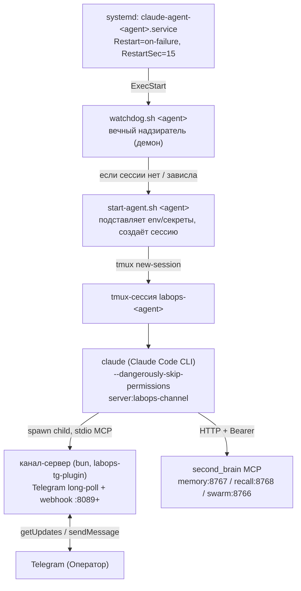
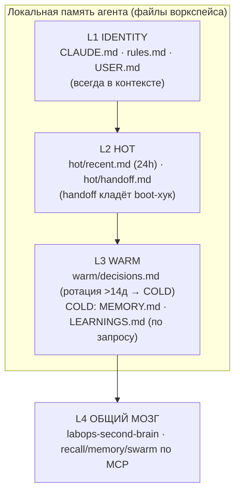
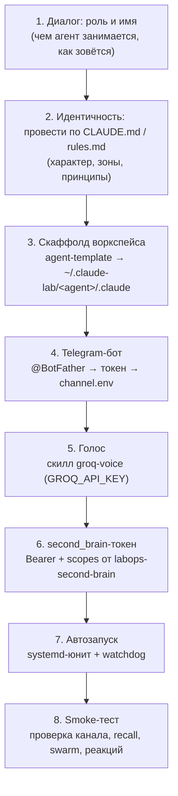

# labops-agent-architecture

**Рантайм- и lifecycle-слой агентной системы labops** — воркспейсы агентов (CLAUDE.md / rules.md / слои памяти), скаффолдер `agent-template`, пер-агентный рантайм (`watchdog.sh → start-agent.sh → tmux → долгоживущая сессия Claude Code`), systemd-юниты, хуки жизненного цикла, автоматизация роя и скилл **`create-agent`**, которым первый агент (Developer / Разработчик) разворачивает остальных агентов «под ключ».

Это один из **трёх** репозиториев системы labops. Он отвечает за то, как агент **живёт** (процессы, память, самовосстановление). Канал и общий мозг — в соседних репозиториях:

- **[`labops-tg-plugin`](../labops-tg-plugin)** — Telegram-канал: пер-агентный бот, голос, реакции, webhook.
- **[`labops-second-brain`](../labops-second-brain)** — общая память: MCP `memory:8767` / `recall:8768` / `swarm:8766` / `task:8769`. Агент получает Bearer-токен и читает/пишет через MCP.

> **Платформа:** Linux + systemd + tmux. На macOS/без systemd агент можно гонять вручную в tmux, но не как службу (нет автозапуска/самовосстановления).

### Минимум, чтобы взлетело

Остальное в README можно читать по мере надобности — для первого агента достаточно:

1. **Зависимости:** `claude` (Claude Code) + разовый `claude setup-token` (подписка Max/Pro), `tmux`, `systemd`, `curl`, `jq`. Плюс соседние репо: `labops-second-brain` (Bearer-токен) и `labops-tg-plugin` (чат).
2. **Поставить движок и войти:** `npm i -g @anthropic-ai/claude-code && claude setup-token`.
3. **Создать первого агента:** `bash install.sh` — спросит имя/модель/Telegram-бота, всё развернёт и прогонит smoke. Для Developer модель по умолчанию `opus` (Opus 4.8).
4. **Telegram-бот заранее:** @BotFather → `/newbot` → токен; свой `user_id` у @userinfobot (см. шаг установки — он проведёт).

Если чего-то нет — установка честно перечислит, что **не** настроено (а не покажет ложный зелёный).

---

## Содержание

1. [Что это и зачем](#1-что-это-и-зачем)
2. [Архитектура рантайма](#2-архитектура-рантайма)
3. [Слои памяти агента](#3-слои-памяти-агента)
4. [agent-template — скаффолдер](#4-agent-template--скаффолдер)
5. [Скилл `create-agent` (end-to-end)](#5-скилл-create-agent-end-to-end)
6. [Хуки жизненного цикла](#6-хуки-жизненного-цикла)
7. [Автоматизация роя](#7-автоматизация-роя)
8. [Скиллы в комплекте](#8-скиллы-в-комплекте)
9. [Установка](#9-установка)
10. [Переменные и настройки](#10-переменные-и-настройки)
11. [Тесты](#11-тесты)
12. [Связанные репозитории](#12-связанные-репозитории)
13. [Лицензия](#13-лицензия)

---

## 1. Что это и зачем

В системе labops **бэкенд устроен Agent-Native**: память, рой и канал — это API/MCP *для агентов*, а не интерфейс для человека. Человеку (Оператору) виден только Telegram. Этот репозиторий — то, что превращает «движок» Claude Code в **постоянно живущего агента**: даёт ему рабочее место (воркспейс с памятью), супервизора (watchdog под systemd), события жизненного цикла (хуки) и связь с роем.

Ключевая идея репозитория — **самозагрузка роя**. Не нужно вручную поднимать каждого агента. Вы устанавливаете **первого агента — Developer / Разработчик**, а дальше он сам, через скилл [`create-agent`](#5-скилл-create-agent-end-to-end), разворачивает следующих: скаффолдит воркспейс, регистрирует Telegram-бота, подключает голос, выдаёт second_brain-токен, ставит автозапуск под systemd и прогоняет smoke-тест. Развёртывание агентов становится операцией самого роя, а не ручной процедурой оператора.



Границы ответственности трёх репозиториев:

| Репозиторий | Слой | Отвечает за |
|---|---|---|
| **labops-agent-architecture** (этот) | Рантайм / lifecycle | воркспейсы, память, watchdog, systemd, хуки, автоматизация роя, скилл `create-agent` |
| **labops-tg-plugin** | Канал | приём из Telegram (long-poll), отправка ответов/реакций, голос, webhook `:8089+` |
| **labops-second-brain** | Память | Postgres+pgvector, MCP memory/recall/swarm/task, RBAC по Bearer-токенам |

---

## 2. Архитектура рантайма

Никто не запускает агентов «вручную» — всё держит **systemd**, и агент сам себя поднимает после любого падения. Страховка **вложенная**: systemd держит watchdog → watchdog держит tmux+claude → claude держит канал-сервер (bun). Падение на любом уровне лечится уровнем выше.



**Цепочка запуска:**

1. **systemd** поднимает службу `claude-agent-<agent>.service` (одна на агента). Главный процесс службы — не `claude`, а `watchdog.sh`.
2. **`watchdog.sh <agent>`** — долгоживущий демон. Если tmux-сессии нет или панель зависла, зовёт `start-agent.sh`. Заодно «реапит» осиротевший канал-сервер (bun).
3. **`start-agent.sh <agent>`** читает секреты из `.claude/secrets/` (chmod 600, никогда не хардкодятся), подставляет env, создаёт tmux-сессию `labops-<agent>` и запускает в ней `claude … server:labops-channel`. Ждёт строку `Listening for channel` (до 30 c).
4. **`claude`** (движок) грузит канал-плагин, спавнит дочерний bun-процесс канала по stdio и подключает MCP second_brain по HTTP+Bearer.

### Модель живости (self-healing) в `watchdog.sh`

Watchdog снимает «хвост» панели tmux каждые ~30 c и классифицирует состояние. Единственный надёжный маркер «идёт ход» — футер **`esc to interrupt`**: Claude Code показывает его всё время хода и убирает в момент завершения. Строку с таймером (`Cooked for Ns`) использовать нельзя — она остаётся на экране после хода и в прошлом приводила к ложным рестартам простаивающего агента.

Два «тихих» режима сбоя, оба невидимы для наивной проверки промпта (зависший TUI всё ещё рисует `❯`):

| Режим | Признак | Реакция watchdog |
|---|---|---|
| **(A) Замёрзший ход** (frozen turn) | `esc to interrupt` присутствует, но панель байт-в-байт не меняется (таймер встал) | подтверждение через ~60 c (2 цикла) → рестарт сессии |
| **(B) Застрявший ввод** (stuck input) | в `❯` лежит неотправленный inbound, активного хода нет | эскалация: `Enter` → `Escape`+`Enter` (коммит bracketed-paste) → рестарт |
| Потерян промпт | TUI не рендерит ни `❯`, ни `bypass permissions`, ни `Listening for channel` | немедленный рестарт |
| Чистый idle-промпт | `❯` есть, поле ввода пустое | **не трогать** (здоровый агент) |

Режим (B) срабатывает **только** при непустом поле ввода — иначе чистый idle-промпт никогда не тревожится (это была главная причина «молчащих» агентов до фикса nbsp-парсинга `❯`). Отдельная защита — реапинг **осиротевшего bun**: если родительский `claude` умер, а канал-сервер «завис» с `PPID==1`, он на 2-ядерном боксе уходит в EPIPE-петлю на ~90 % CPU и душит живые сессии; watchdog/start-agent убивают его `pkill` строго по пути конкретного агента.

### Три уровня самовосстановления

| Что чинит | Кто чинит | Как |
|---|---|---|
| зависшая / мёртвая сессия агента | `watchdog.sh` | детектит застывшую панель → `start-agent.sh` пересоздаёт сессию (`handoff.md` хранит последние события) |
| упавший watchdog | `systemd` | `Restart=on-failure` + `RestartSec=15` |
| осиротевший bun (claude умер, bun на PID 1) | `watchdog.sh` / `start-agent.sh` | `pkill -9` по пути агента |
| сервисы second_brain | `systemd` | отдельные службы `second_brain-*.service` |

---

## 3. Слои памяти агента

У агента четыре слоя памяти: первые три — локальные файлы в его воркспейсе (`@core/…`, частично всегда в контексте), четвёртый — общий мозг `labops-second-brain` по MCP. Иерархия истины: **live-проверка (exec/grep) → second_brain (общий мозг) → git-история → локальная память**. Память противоречит проверке — побеждает проверка.



| Слой | Файлы / источник | В контексте | Кто правит |
|---|---|---|---|
| **L1 Идентичность** | `CLAUDE.md`, `rules.md`, `USER.md` | всегда (`@import`) | только оператор (RED-зона) |
| **L2 Hot** | `hot/recent.md` (скользящие 24 ч), `hot/handoff.md` | да (handoff кладёт boot-хук) | агент автономно (GREEN) |
| **L3 Warm** | `warm/decisions.md` (последние ~14 д, ротация в COLD) | да | агент с обоснованием (YELLOW) |
| **COLD** | `MEMORY.md`, `LEARNINGS.md` | нет — по запросу (Read) | агент (GREEN) |
| **L4 Общий** | second_brain `recall` / `memory` / `swarm` | нет — по запросу (MCP) | по RBAC-scopes |

Зоны доступа к файлам: **RED** (`CLAUDE.md`, `rules.md`, `USER.md`) — только оператор; **YELLOW** (`decisions.md`, `AGENTS.md`, `TOOLS.md`) — агент с обоснованием; **GREEN** (`LEARNINGS.md`, `hot/recent.md`, `feedback_*`) — агент автономно.

**Политика записи в общий мозг** зафиксирована в [`SECONDBRAIN_WRITE_RULES.md`](SECONDBRAIN_WRITE_RULES.md) — это единый canonical-файл (RED-зона), который симлинкуется в `core/` каждого агента и **@-импортится в его `CLAUDE.md`** (`@core/SECONDBRAIN_WRITE_RULES.md`). Правишь один файл → подхватывают все агенты. Четыре дисциплины: (1) `recall` **перед** записью — не плодить дубли; (2) **dual-write** важного — и в локальный `.md`, и в second_brain (идемпотентно по sha256); (3) писать **сразу**, не «потом» (компакция знания не выгружает); (4) писать в свой `scope`. Инструменты записи жёстко зафиксированы кодом: `create_decision_note`, `create_runbook_note`, `create_error_pattern_note`, `create_external_note`, `create_personal_note` (→ `15-personal`), `create_project_note` (→ `40-projects`), `create_handoff`, `append_daily_log`, `supersede_decision`.

---

## 4. agent-template — скаффолдер

[`agent-template/`](agent-template/) — полный шаблон воркспейса Claude Code, проводнённый к общему `labops-second-brain` (memory + recall + swarm). Интерактивный `install.sh` спрашивает идентичность агента и параметры подключения к мозгу, рендерит шаблоны и собирает воркспейс в `~/.claude-lab/<agent-id>/.claude/`.

**Промпты при скаффолде** (попадают в плейсхолдеры `CLAUDE.md`): имя (`{{AGENT_NAME}}`), роль (`{{AGENT_ROLE}}` / `{{AGENT_ROLE_DESCRIPTION}}`), характер (`{{CHARACTER_TRAITS}}`), как обращаться к оператору, язык ответов, модель; плюс параметры мозга — `MCP_HOST`, `AGENT_BEARER`, `AGENT_SCOPES`.

**Что генерируется:**

```
~/.claude-lab/<agent-id>/.claude/
├── CLAUDE.md            # SOUL / идентичность (из templates/CLAUDE.md.template)
├── .mcp.json            # ТОЛЬКО 3 сервера second_brain (memory/recall/swarm), chmod 600
├── settings.json        # хуки SessionStart / Stop / PreCompact
├── agent.env            # source перед запуском: MCP_HOST / AGENT_BEARER
├── core/
│   ├── USER.md · rules.md · AGENTS.md · MEMORY.md · LEARNINGS.md
│   ├── warm/decisions.md           # WARM (последние 14д)
│   └── hot/{recent.md, handoff.md, archive/, pre-compact/}
├── tools/TOOLS.md
├── scripts/             # ротация памяти + second_brain-recall-on-start
├── hooks/               # session-start, stop, precompact
├── logs/
└── skills/              # симлинк на общий бандл скиллов
```

| Каталог шаблона | Содержимое |
|---|---|
| `templates/` | `CLAUDE.md`, `rules.md`, `USER.md`, `tools.md`, `agents.md`, `decisions.md`, `recent.md`, `MEMORY.md`, `LEARNINGS.md`, `mcp.json`, `settings.json` |
| `hooks/` | `session-start-hook.sh`, `stop-hook.sh`, `precompact-hook.sh` |
| `scripts/` | `memory-rotate.sh`, `trim-hot.sh`, `rotate-warm.sh`, `compress-warm.sh`, `second_brain-recall-on-start.sh` |
| `docs/` | `ARCHITECTURE.md`, `MEMORY.md`, `HOOKS.md`, `MULTI-AGENT.md`, `SETUP-GUIDE.md`, `AGENT-LAWS.md`, … (16 файлов) |

Важно: `mcp.json.template` подключает агенту **только** second_brain (3 сервера). Канал (`labops-channel`) грузится отдельно при запуске через `claude … server:labops-channel`, а task-board MCP (`:8769`) агентам намеренно **не** заводится (heartbeat идёт отдельным кроном).

---

## 5. Скилл `create-agent` (end-to-end)

> Лежит в `skills/create-agent/`. Это **ядро репозитория** — то, чем первый агент (Developer) разворачивает остальных. Описание ниже — целевое поведение скилла; он авторится параллельно лидом.

Когда Оператору нужен новый агент, он просит об этом Developer-агента в Telegram. Тот запускает скилл `create-agent`, который проводит развёртывание целиком — от диалога о роли до прошедшего smoke-теста — не требуя ручных шагов от оператора.



| Шаг | Что делает | Артефакт |
|---|---|---|
| 1. Роль и имя | спрашивает у Оператора роль (кодер / контент / ресёрч / …) и `<agent-id>` | — |
| 2. Идентичность | проводит по `CLAUDE.md` (SOUL, характер, принципы) и `rules.md` | заполненные RED-файлы |
| 3. Скаффолд | прогоняет `agent-template` → рендерит шаблоны | `~/.claude-lab/<agent>/.claude/` |
| 4. Telegram-бот | регистрирует бота через `@BotFather`, пишет токен | `channel.env` (`/etc/labops-plugin/<agent>/` или `shared/state/<agent>/telegram/`) |
| 5. Голос | подключает скилл `groq-voice` (транскрипция `.ogg`) | `GROQ_API_KEY` в секретах |
| 6. Токен мозга | запрашивает у `labops-second-brain` Bearer + `scopes` | `.mcp.json` (chmod 600) |
| 7. Автозапуск | ставит `claude-agent-<agent>.service` + watchdog, добавляет в roster | юнит + строка в `agents.conf` |
| 8. Smoke-тест | финальная проверка: канал слушает, recall/swarm отвечают, реакции ставятся | зелёный прогон |

Токен Telegram-бота извлекается **не из хардкода**, а из `channel.env` через `orchestration/lib/agents.sh::agent_bot_token` (ищет `/etc/labops-plugin/<agent>/channel.env`, затем `$CLAUDE_LAB/shared/state/<agent>/telegram/channel.env`).

---

## 6. Хуки жизненного цикла

Хук — **не сервер**: движок Claude Code в определённый момент испускает событие, читает `settings.json`, спавнит команду как дочерний процесс (на stdin — JSON с путём к транскрипту и `session_id`), скрипт отрабатывает за миллисекунды-секунды и выходит. Все три хука **fail-open**: любая ошибка → `exit 0`, харнесс никогда не подвисает. Подробнее о загрузке `settings.json` — в `labops-tg-plugin/docs/06`.

| Событие | Хук (`agent-template/hooks/`) | Что делает |
|---|---|---|
| **SessionStart** | `session-start-hook.sh` | логирует старт; если есть `MCP_HOST`+`AGENT_BEARER` — зовёт `second_brain-recall-on-start.sh` (дописывает блок релевантных recall в `hot/recent.md`); surface `handoff.md`. В рое также `agent-boot-sequence.sh`: 👀 на свежие сообщения + `swarm.list_my_pending()` (забрать делегированные задачи — pull-страховка) |
| **Stop** | `stop-hook.sh` | дописывает 200-символьный сниппет хода в `hot/recent.md` и подробную JSON-строку в `logs/verbose-YYYY-MM-DD.jsonl`. В рое также `read-receipt-hook.ts` (POST `/hooks/react` → 👌) и `reflect-error-pattern.sh` (если Оператор поправил → нудж записать error-pattern через `decision:"block"`) |
| **PreCompact** | `precompact-hook.sh` | снапшотит `hot/recent.md` в `hot/pre-compact/` перед авто-компакцией, держит последние `KEEP_SNAPSHOTS` (10) |

Все хуки несут `sdk-guard`: при `CLAUDE_SDK_CHILD=1` (или `entrypoint=sdk-ts`) сразу выходят, чтобы не зацикливаться в дочерних Agent-SDK-сессиях.

---

## 7. Автоматизация роя

Скрипты в [`orchestration/`](orchestration/) — это «однодневки» по триггеру (cron / событие), а не постоянные процессы. Roster агентов берётся через `orchestration/lib/agents.sh::list_agents` — **не хардкодом**: сначала `$CLAUDE_LAB/agents.conf` (по строке на agent-id, см. `agents.conf.example`), иначе скан `$CLAUDE_LAB/*/.claude` с исключением инфра-каталогов (`shared`, `logs`, `mcp-servers`).

| Скрипт | Триггер | Назначение |
|---|---|---|
| `heartbeat-all.sh` | cron, раз в минуту | heartbeat только живых tmux-сессий → супервизор отличает живых агентов от мёртвых (у мёртвых `last_seen` устаревает, их задачи реклеймятся) |
| `night-learnings.sh` | cron, 02:00 UTC | ночной learnings-цикл: `swarm.notify` каждому → review 7-дневных learnings → обновить `rules.md` |
| `message-reaction-daemon.sh` | фоновый демон на агента | ставит 👀 на **все** входящие (текст/голос/стикеры) немедленно, опрос каждые ~3 c |
| `start-reaction-daemons.sh` | `@reboot` | поднимает reaction-демоны для всех агентов roster, с PID-файлами |
| `set-message-reaction.sh` / `handle-incoming-messages.sh` | вспомогательные | примитивы реакций и обработки входящих |
| `vault-audit-broadcast.sh` + `second_brain-vault-audit.sh` | по запросу / cron | рассылает рою задачу проверить и дозаполнить общий vault |
| `agent-boot-sequence.sh` | SessionStart | детерминированно забирает делегированные задачи (`list_my_pending`) |
| `reflect-error-pattern.sh` | Stop | нудж записать error-pattern при коррекции от Оператора |
| `update-rules.sh`, `tg-send.sh`, `second_brain-heartbeat.py` | вспомогательные | обновление правил, отправка в TG, heartbeat-клиент |

**Двухстадийные реакции (2026-06-25):** 👀 «получил» — мгновенно при приёме (≈1 c, fire-and-forget) и 👌 «готово» — в конце хода (read-receipt-хук). Два эмодзи = два смысла, сигнал не «врёт» на занятой сессии. `✅` намеренно не используется — его нет в whitelist реакций Telegram-ботов.

---

## 8. Скиллы в комплекте

Бандл в [`skills/`](skills/) ставится симлинком в `~/.claude/skills/<name>` или пер-агентно. Скиллы независимы и не зависят от second_brain.

| Скилл | Что делает | Нужно |
|---|---|---|
| `groq-voice` | транскрипция голосовых `.ogg` через Groq Whisper (обязательно при `<media:audio>`) | `GROQ_API_KEY` |
| `second_brain-doctor` | агент-сайд-диагностика second_brain: коннект, identity, recall, swarm, hooks-parity, webhooks, repo, безопасность MCP-URL; вывод редактируется (секреты маскируются) | — |
| `mcp-builder` | гайд (от Anthropic) по созданию новых MCP-серверов (FastMCP / TS SDK) | — |
| `markdown-new` | чистый Markdown из любого URL через `markdown.new` (замена шумному web_fetch, ~80 % экономии токенов) | — |
| `transcript` | транскрипты YouTube через TranscriptAPI.com | `TRANSCRIPT_API_KEY` |
| `agent-browser` | браузерная автоматизация через CDP (навигация, формы, скриншоты) | бинарь `agent-browser` |

---

## 9. Установка

> `install.sh` в корне репозитория авторится параллельно лидом; ниже — его целевое поведение.

Корневой `install.sh` ставит **первого агента — Developer / Разработчик** «под ключ» end-to-end и в конце прогоняет тесты/smoke. Внутри он использует те же примитивы, что и скилл `create-agent`: скаффолд через `agent-template`, регистрация бота, голос, second_brain-токен, systemd-автозапуск.

**Зависимости (скрипт их проверяет):**

- установленный **`labops-second-brain`** — чтобы выдать агенту Bearer-токен и поднять MCP `memory`/`recall`/`swarm`;
- установленный **`labops-tg-plugin`** — канал, через который агент общается в Telegram;
- **Claude Code (движок) + подключённая модель** — `npm i -g @anthropic-ai/claude-code`, затем **разово авторизоваться по подписке**: `claude setup-token` (Max/Pro, первая сторона — без third-party риска). Модель агента задаётся в `settings.json` (поле `model`); диалог установки спрашивает её и для Developer рекомендует **`opus` (Opus 4.8)**. Без авторизации агент стартует под systemd, но не достучится до модели — это ловит smoke-тест (шаг «модель отвечает»).

```bash
# 1. Сначала поднять соседние репозитории (мозг + канал)
#    см. labops-second-brain/README и labops-tg-plugin/README

# 1a. Подключить движок и модель
npm i -g @anthropic-ai/claude-code
claude setup-token       # вход по подписке Max/Pro (выбор модели — в диалоге установки ниже)

# 2. Установить Developer-агента из этого репозитория
cd labops-agent-architecture
bash install.sh          # модель → идентичность → скаффолд → бот → голос → токен → systemd → smoke

# 3. После установки рой расширяется самим Developer-агентом
#    (он вызывает скилл create-agent по просьбе Оператора)
```

Скаффолд одного воркспейса без полного развёртывания — через `agent-template/install.sh` (см. [`agent-template/README.md`](agent-template/README.md)).

---

## 10. Переменные и настройки

| Переменная | Где | Назначение |
|---|---|---|
| `MCP_HOST` | `.mcp.json`, `agent.env` | базовый URL second_brain (рендерит `${MCP_HOST}/memory/mcp` и т.д.) |
| `AGENT_BEARER` | `.mcp.json` (chmod 600) | Bearer-токен агента для MCP (в БД хранится только `token_sha256`) |
| `AGENT_SCOPES` | install | RBAC-scopes на чтение/запись (scope = первая папка пути в vault) |
| `CLAUDE_LAB` | окружение | корень лаборатории (по умолчанию `$HOME/.claude-lab`); roster и токены ищутся относительно него |
| `GROQ_API_KEY` | `.claude/secrets/groq-api-key` | транскрипция голоса (Groq Whisper) |
| `TELEGRAM_BOT_TOKEN` | `.claude/secrets/telegram-bot-token`, `channel.env` | токен бота агента (`@BotFather`) |
| `TELEGRAM_WEBHOOK_TOKEN` | `.claude/secrets/telegram-webhook-token` | Bearer для входящих POST на `/hooks/*` |
| `TELEGRAM_WEBHOOK_PORT` | `start-agent.sh` (config, не секрет) | порт webhook агента (`:8089+`, по агенту) |
| `TELEGRAM_ALLOWED_USER_IDS` | `start-agent.sh` | allowlist собеседников — только Оператор; чужие отбрасываются на гейте |
| `TELEGRAM_STATE_DIR` | `start-agent.sh` | `~/.claude/channels/labops-<agent>` — состояние канала |
| `TELEGRAM_WORKSPACE_ROOT` | `start-agent.sh` | корень для вложений (защита от path-traversal) |
| `CLAUDE_CODE_AUTO_COMPACT_WINDOW` | `settings.json` | окно авто-компакции (400000) |
| `KEEP_SNAPSHOTS` | `precompact-hook.sh` | сколько pre-compact снапшотов держать (10) |
| `CLAUDE_SDK_CHILD` | окружение | `=1` → хуки выходят сразу (anti-recursion для Agent SDK) |

Секреты лежат в `~/.claude-lab/<agent>/.claude/secrets/` с `chmod 600` и **никогда не хардкодятся** в скриптах; `start-agent.sh` падает быстро, если секрет отсутствует/нечитаем.

---

## 11. Тесты

- **Синтаксис-чек bash** — `bash -n` по всем скриптам `orchestration/*.sh`, `agent-template/hooks/*.sh`, `agent-template/scripts/*.sh` (хуки fail-open, поэтому статической проверки + smoke достаточно).
- **Self-test репозитория** (`test.sh`) — синтаксис bash, компиляция python, отсутствие секретов и проверка, что модель/авторизация учтены (`settings.json` задаёт `model`, `create-agent` пробрасывает выбор модели, есть шаг `claude setup-token`).
- **Smoke-тест** в конце `install.sh` / `create-agent`: **модель отвечает** (Claude Code авторизован, `claude -p ping`); сессия агента дошла до `Listening for channel`; канал отвечает; `recall`/`swarm` доступны по Bearer; реакции 👀/👌 ставятся.
- **`second_brain-doctor`** (скилл) — повторяемая агент-сайд-диагностика связки second_brain после установки.

```bash
# Синтаксис всех bash-скриптов
find orchestration agent-template -name '*.sh' -exec bash -n {} \;
```

---

## 11a. Если что-то не работает (troubleshooting)

Зелёный smoke означает: воркспейс создан, мозг отвечает по Bearer, токен бота валиден (`getMe`), модель отвечает, сервис `active`. Он **не** доказывает, что вы написали боту с разрешённого `user_id`. Частые случаи:

| Симптом | Где смотреть / что делать |
|---|---|
| Бот молчит в Telegram | `tmux ls` → есть ли `labops-<agent>`? `tmux attach -t labops-<agent>` — видно ошибку. Проверьте, что ваш `user_id` в `TELEGRAM_ALLOWED_USER_IDS` (`channel.env`). |
| Сервис не `active` | `systemctl status claude-agent-<agent>` + `journalctl -u claude-agent-<agent> -n50`. Частая причина — `claude` не авторизован (`claude setup-token`) или нет `channel.env`. |
| `no TELEGRAM_BOT_TOKEN` в логе | `channel.env` не там, где ищет `start-agent.sh` — он берёт из `lib/agents.sh` (`/etc/labops-plugin/<agent>/` или `$CLAUDE_LAB/shared/state/<agent>/telegram/`). Пересоздайте через `new-agent.sh`. |
| «Модель не ответила» | `claude setup-token` под пользователем агента, затем `systemctl restart claude-agent-<agent>`. |
| `second_brain недоступен` | Проверьте `MCP_HOST` в `agent.env` (локально `127.0.0.1:8767`, удалённо — IP/домен VPS) и что мозг поднят. |
| Повторный запуск/коллизия имени | `new-agent.sh` не затирает существующего агента; для донастройки поверх — `REUSE_EXISTING=1`. |

Перезапуск self-test без установки агента: `bash install.sh --test-only`.

---

## 12. Связанные репозитории

| Репозиторий | Слой | Что предоставляет |
|---|---|---|
| **labops-agent-architecture** (этот) | рантайм / lifecycle | воркспейсы, память, watchdog/systemd, хуки, автоматизация роя, `create-agent` |
| **labops-tg-plugin** | канал | пер-агентный Telegram-бот, голос, реакции, webhook `:8089+`, MCP-инструменты канала (`reply`/`react`/…) |
| **labops-second-brain** | память | Postgres+pgvector, MCP `memory:8767` / `recall:8768` / `swarm:8766` / `task:8769`, RBAC по Bearer |

---

## 13. Лицензия

Apache 2.0.
