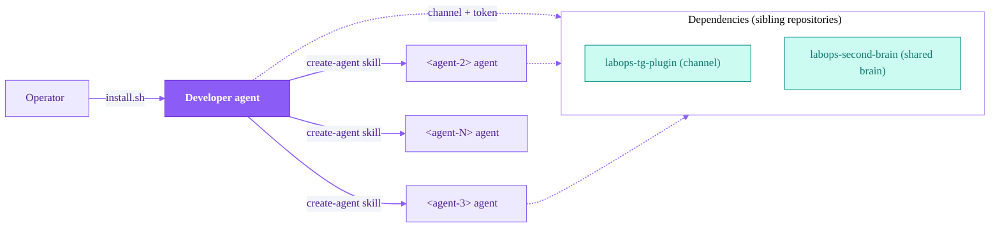
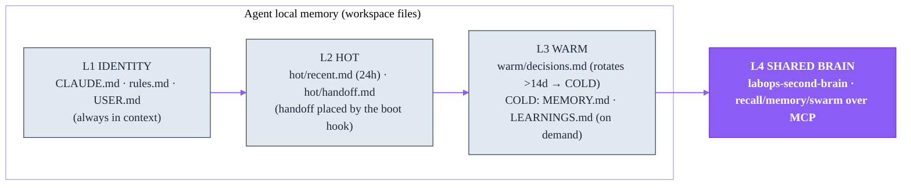

<p align="center">
  <picture>
    <source media="(prefers-color-scheme: dark)" srcset="assets/labops-logo-dark.svg">
    
  </picture>
</p>

<h1 align="center">labops-agent-architecture</h1>

<p align="center"><em>AI operations — from inside the profession</em></p>

<p align="center">
  <a href="https://labopsai.pro"></a>
  <a href="./LICENSE"></a>
  
</p>

<p align="center"><a href="README.md"><b>English</b></a> · <a href="README.ru.md">Русский</a></p>

<p align="center">
  <b>Part of labops:</b>
  <a href="https://github.com/dediukhinpa/labops-tg-plugin">tg-plugin</a> ·
  <a href="https://github.com/dediukhinpa/labops-second-brain">second-brain</a> ·
  <b>agent-architecture</b>
</p>

**The runtime and lifecycle layer of the labops agent system** — agent workspaces (CLAUDE.md / rules.md / memory layers), the `agent-template` scaffolder, a per-agent runtime (`watchdog.sh → start-agent.sh → tmux → a long-lived Claude Code session`), systemd units, lifecycle hooks, swarm automation, and the **`create-agent`** skill that the first agent (Developer) uses to roll out the rest of the swarm turnkey.

This is one of the **three** repositories of the labops system. It owns how an agent **lives** (processes, memory, self-healing). The channel and the shared brain live in the sibling repositories:

- **[`labops-tg-plugin`](https://github.com/dediukhinpa/labops-tg-plugin)** — the Telegram channel: per-agent bot, voice, reactions, webhook.
- **[`labops-second-brain`](https://github.com/dediukhinpa/labops-second-brain)** — shared memory: MCP `memory:8767` / `recall:8768` / `swarm:8766` / `task:8769`. The agent receives a Bearer token and reads/writes through MCP.

> [!IMPORTANT]
> **Platform:** Linux + systemd + tmux. On macOS / without systemd you can run an agent manually in tmux, but not as a service (no autostart / self-healing).

---

## Table of contents

1. [Why labops](#why-labops)
2. [Quickstart](#quickstart)
3. [Runtime architecture](#runtime-architecture)
4. [Agent memory layers](#agent-memory-layers)
5. [agent-template — scaffolder](#agent-template--scaffolder)
6. [The `create-agent` skill (end-to-end)](#the-create-agent-skill-end-to-end)
7. [Lifecycle hooks & swarm automation](#lifecycle-hooks--swarm-automation)
8. [Bundled skills](#bundled-skills)
9. [Installation & model/auth](#installation--modelauth)
10. [Configuration & environment](#configuration--environment)
11. [Troubleshooting](#troubleshooting)
12. [FAQ](#faq)
13. [Data & privacy](#data--privacy)
14. [Part of labops](#part-of-labops)
15. [License](#license)

---

## Why labops

In the labops system the **backend is Agent-Native**: memory, swarm, and channel are APIs/MCP *for agents*, not a UI for humans. A human (the Operator) sees only Telegram. This repository is what turns the Claude Code "engine" into a **continuously living agent** — it gives it a workplace (a workspace with memory), a supervisor (a watchdog under systemd), lifecycle events (hooks), and a link to the swarm.

- **Self-bootstrapping swarm.** You don't bring up each agent by hand. You install the **first agent — Developer** — and from there it rolls out the next ones itself via the [`create-agent`](#the-create-agent-skill-end-to-end) skill.
- **One install, then the swarm grows itself.** `create-agent` scaffolds a workspace, registers a Telegram bot, wires up voice, issues a second_brain token, sets up autostart under systemd, and runs a smoke test — turning agent deployment into an operation of the swarm itself rather than a manual Operator procedure.
- **Nested self-healing.** systemd holds the watchdog, the watchdog holds tmux+claude, claude holds the channel server. A failure at any level is healed by the level above.
- **Truth beats memory.** The hierarchy is live check (exec/grep) → second_brain (shared brain) → git history → local memory. When memory contradicts a live check, the check wins.
- **Honest install.** If something is missing, the installer plainly lists what is **not** configured instead of showing a false green.



Responsibility boundaries of the three repositories:

| Repository | Layer | Owns |
|---|---|---|
| **labops-agent-architecture** (this one) | Runtime / lifecycle | workspaces, memory, watchdog, systemd, hooks, swarm automation, the `create-agent` skill |
| **labops-tg-plugin** | Channel | receiving from Telegram (long-poll), sending replies/reactions, voice, webhook `:8089+` |
| **labops-second-brain** | Memory | Postgres+pgvector, MCP memory/recall/swarm/task, RBAC via Bearer tokens |

---

## Quickstart

Everything else in this README can be read as needed — for the first agent this is enough:

1. **Dependencies:** `claude` (Claude Code) + a one-time `claude setup-token` (Max/Pro subscription), `tmux`, `systemd`, `curl`, `jq`. Plus the sibling repos: `labops-second-brain` (Bearer token) and `labops-tg-plugin` (chat).
2. **Install the engine and sign in:** `npm i -g @anthropic-ai/claude-code && claude setup-token`.
3. **Create the first agent:** `bash install.sh` — it asks for name/model/Telegram bot, deploys everything, and runs a smoke test. For the Developer the default model is `opus` (Opus 4.8).
4. **Telegram bot up front:** @BotFather → `/newbot` → token; get your `user_id` from @userinfobot (the install step will walk you through it).

> [!TIP]
> For the Developer the default model is `opus` (Opus 4.8). You install only the first agent — then the swarm grows itself: the Developer spawns the rest via the `create-agent` skill.

```bash
# 1. Bring up the sibling repos first (brain + channel)
#    see labops-second-brain/README and labops-tg-plugin/README

# 1a. Install the engine and connect the model
npm i -g @anthropic-ai/claude-code
claude setup-token       # sign in with a Max/Pro subscription (model choice is in the install dialog below)

# 2. Install the Developer agent from this repository
cd labops-agent-architecture
bash install.sh          # model → identity → scaffold → bot → voice → token → systemd → smoke

# 3. After install, the swarm is grown by the Developer agent itself
#    (it invokes the create-agent skill at the Operator's request)
```

If something is missing, the install honestly lists what is **not** configured (rather than showing a false green).

---

## Runtime architecture

Nobody runs agents "by hand" — **systemd** holds everything, and the agent brings itself back up after any crash. The safety net is **nested**: systemd holds the watchdog → the watchdog holds tmux+claude → claude holds the channel server (bun). A failure at any level is healed by the level above.

```mermaid
%%{init: {'theme':'base','themeVariables':{'primaryColor':'#EDE9FE','primaryTextColor':'#4C1D95','primaryBorderColor':'#8B5CF6','lineColor':'#8B5CF6','secondaryColor':'#F1F5F9','tertiaryColor':'#ffffff','clusterBkg':'transparent','clusterBorder':'#B794F4','fontFamily':'Helvetica,Arial,sans-serif'}}}%%
flowchart LR
  subgraph boot["Boot · supervision"]
    direction TB
    SD["systemd: claude-agent-&lt;agent&gt;.service<br/>Restart=on-failure, RestartSec=15"]
    WD["watchdog.sh &lt;agent&gt;<br/>eternal supervisor (daemon)"]
    SA["start-agent.sh &lt;agent&gt;<br/>injects env/secrets, creates the session"]
    TM["tmux session labops-&lt;agent&gt;"]
    SD -->|ExecStart| WD
    WD -->|if no session / frozen| SA
    SA -->|tmux new-session| TM
  end
  subgraph live["Live runtime"]
    direction TB
    CC["claude (Claude Code CLI)<br/>--dangerously-skip-permissions<br/>server:labops-channel"]
    BUN["channel server (bun, labops-tg-plugin)<br/>Telegram long-poll + webhook :8089+"]
    SB["second_brain MCP<br/>memory:8767 / recall:8768 / swarm:8766"]
  end
  TM --> CC
  CC -->|spawn child, stdio MCP| BUN
  CC -->|HTTP + Bearer| SB
  BUN <-->|getUpdates / sendMessage| TG["Telegram (Operator)"]
  classDef brand fill:#8B5CF6,stroke:#6D28D9,color:#ffffff,font-weight:bold
  classDef ext fill:#CCFBF1,stroke:#0D9488,color:#0F766E
  classDef store fill:#FEF3C7,stroke:#D97706,color:#92400E
  classDef sys fill:#E2E8F0,stroke:#334155,color:#1E293B
  linkStyle default stroke:#8B5CF6,stroke-width:1.5px
  class CC brand
  class SD,WD,SA,TM sys
  class BUN,SB,TG ext
```



**Startup chain:**

1. **systemd** brings up the `claude-agent-<agent>.service` unit (one per agent). The main process of the service is not `claude` but `watchdog.sh`.
2. **`watchdog.sh <agent>`** — a long-lived daemon. If the tmux session is missing or the pane is frozen, it calls `start-agent.sh`. It also "reaps" an orphaned channel server (bun).
3. **`start-agent.sh <agent>`** reads secrets from `.claude/secrets/` (chmod 600, never hardcoded), injects env, creates the tmux session `labops-<agent>`, and launches `claude … server:labops-channel` in it. It waits for the line `Listening for channel` (up to 30 s).
4. **`claude`** (the engine) loads the channel plugin, spawns the child bun channel process over stdio, and connects the second_brain MCP over HTTP+Bearer.

### Liveness model (self-healing) in `watchdog.sh`

> [!NOTE]
> The watchdog grabs the tmux pane "tail" every ~30 s and classifies the state. The only reliable "a turn is in progress" marker is the **`esc to interrupt`** footer: Claude Code shows it the whole time a turn runs and removes it the moment the turn finishes. The timer line (`Cooked for Ns`) must not be used — it stays on screen after the turn and, in the past, caused false restarts of an idle agent.

Two "silent" failure modes, both invisible to a naive prompt check (a frozen TUI still draws `❯`):

| Mode | Sign | Watchdog reaction |
|---|---|---|
| **(A) Frozen turn** | `esc to interrupt` present but the pane is byte-for-byte unchanged (timer stalled) | confirmation after ~60 s (2 cycles) → restart the session |
| **(B) Stuck input** | an unsent inbound sits in `❯`, no active turn | escalation: `Enter` → `Escape`+`Enter` (commit the bracketed paste) → restart |
| Lost prompt | the TUI renders neither `❯`, nor `bypass permissions`, nor `Listening for channel` | immediate restart |
| Clean idle prompt | `❯` present, input field empty | **don't touch** (healthy agent) |

Mode (B) fires **only** on a non-empty input field — otherwise a clean idle prompt is never disturbed (this was the main cause of "silent" agents before the `❯` nbsp-parsing fix). A separate safeguard is **orphaned-bun reaping**: if the parent `claude` died and the channel server "hangs" with `PPID==1`, on a 2-core box it spins into an EPIPE loop at ~90% CPU and chokes live sessions; the watchdog/start-agent kill it with `pkill` strictly by the specific agent's path.

<details>
<summary><b>Three levels of self-healing</b></summary>

| What is fixed | Who fixes it | How |
|---|---|---|
| frozen / dead agent session | `watchdog.sh` | detects a frozen pane → `start-agent.sh` recreates the session (`handoff.md` keeps the latest events) |
| crashed watchdog | `systemd` | `Restart=on-failure` + `RestartSec=15` |
| orphaned bun (claude died, bun on PID 1) | `watchdog.sh` / `start-agent.sh` | `pkill -9` by the agent's path |
| second_brain services | `systemd` | separate `second_brain-*.service` units |

</details>

> [!NOTE]
> **Operator alerts.** On each of these events the watchdog also pings the Operator in Telegram (via the agent's own bot, `tg-send.sh` → `lib/notify.sh`): a session restart **with its cause**, a lost/unrendered prompt, an unsubmitted ("stuck") prompt, and a reaped orphaned channel server. Alerts are best-effort (a failed send never disrupts the watchdog) and throttled per-message, so flapping doesn't spam. Toggle with `WATCHDOG_TG_ALERTS` (default `1`), tune `WATCHDOG_ALERT_COOLDOWN` (seconds, default `300`), or route to a dedicated chat with `WATCHDOG_ALERT_CHAT_ID`.

---

## Agent memory layers

An agent has four memory layers: the first three are local files in its workspace (`@core/…`, partly always in context), the fourth is the shared brain `labops-second-brain` over MCP. Truth hierarchy: **live check (exec/grep) → second_brain (shared brain) → git history → local memory**. When memory contradicts the check, the check wins.



| Layer | Files / source | In context | Who edits |
|---|---|---|---|
| **L1 Identity** | `CLAUDE.md`, `rules.md`, `USER.md` | always (`@import`) | Operator only (RED zone) |
| **L2 Hot** | `hot/recent.md` (rolling 24 h), `hot/handoff.md` | yes (handoff placed by the boot hook) | agent autonomously (GREEN) |
| **L3 Warm** | `warm/decisions.md` (last ~14 d, rotates into COLD) | yes | agent with justification (YELLOW) |
| **COLD** | `MEMORY.md`, `LEARNINGS.md` | no — on demand (Read) | agent (GREEN) |
| **L4 Shared** | second_brain `recall` / `memory` / `swarm` | no — on demand (MCP) | per RBAC scopes |

File access zones: **RED** (`CLAUDE.md`, `rules.md`, `USER.md`) — Operator only; **YELLOW** (`decisions.md`, `AGENTS.md`, `TOOLS.md`) — agent with justification; **GREEN** (`LEARNINGS.md`, `hot/recent.md`, `feedback_*`) — agent autonomously.

The **shared-brain write policy** is fixed in [`SECONDBRAIN_WRITE_RULES.md`](SECONDBRAIN_WRITE_RULES.md) — a single canonical file (RED zone) that is symlinked into every agent's `core/` and **@-imported into its `CLAUDE.md`** (`@core/SECONDBRAIN_WRITE_RULES.md`). Edit one file → every agent picks it up. Four disciplines: (1) `recall` **before** writing — don't breed duplicates; (2) **dual-write** what matters — both to the local `.md` and to second_brain (idempotent by sha256); (3) write **immediately**, not "later" (knowledge compaction does not flush); (4) write into your own `scope`. The write tools are hard-fixed in code: `create_decision_note`, `create_runbook_note`, `create_error_pattern_note`, `create_external_note`, `create_personal_note` (→ `15-personal`), `create_project_note` (→ `40-projects`), `create_handoff`, `append_daily_log`, `supersede_decision`.

---

## agent-template — scaffolder

[`agent-template/`](agent-template/) is a complete Claude Code workspace template, wired to the shared `labops-second-brain` (memory + recall + swarm). The interactive `install.sh` asks for the agent's identity and brain connection parameters, renders the templates, and assembles the workspace into `~/.claude-lab/<agent-id>/.claude/`.

**Prompts during scaffolding** (they fill `CLAUDE.md` placeholders): name (`{{AGENT_NAME}}`), role (`{{AGENT_ROLE}}` / `{{AGENT_ROLE_DESCRIPTION}}`), character (`{{CHARACTER_TRAITS}}`), how to address the Operator, response language, model; plus brain parameters — `MCP_HOST`, `AGENT_BEARER`, `AGENT_SCOPES`.

**What gets generated:**

```
~/.claude-lab/<agent-id>/.claude/
├── CLAUDE.md            # SOUL / identity (from templates/CLAUDE.md.template)
├── .mcp.json            # ONLY the 3 second_brain servers (memory/recall/swarm), chmod 600
├── settings.json        # SessionStart / Stop / PreCompact hooks
├── agent.env            # source before launch: MCP_HOST / AGENT_BEARER
├── core/
│   ├── USER.md · rules.md · AGENTS.md · MEMORY.md · LEARNINGS.md
│   ├── warm/decisions.md           # WARM (last 14d)
│   └── hot/{recent.md, handoff.md, archive/, pre-compact/}
├── tools/TOOLS.md
├── scripts/             # memory rotation + second_brain-recall-on-start
├── hooks/               # session-start, stop, precompact
├── logs/
└── skills/              # symlink to the shared skill bundle
```

| Template directory | Contents |
|---|---|
| `templates/` | `CLAUDE.md`, `rules.md`, `USER.md`, `tools.md`, `agents.md`, `decisions.md`, `recent.md`, `MEMORY.md`, `LEARNINGS.md`, `mcp.json`, `settings.json` |
| `hooks/` | `session-start-hook.sh`, `stop-hook.sh`, `precompact-hook.sh` |
| `scripts/` | `memory-rotate.sh`, `trim-hot.sh`, `rotate-warm.sh`, `compress-warm.sh`, `second_brain-recall-on-start.sh` |
| `docs/` | `ARCHITECTURE.md`, `MEMORY.md`, `HOOKS.md`, `MULTI-AGENT.md`, `SETUP-GUIDE.md`, `AGENT-LAWS.md`, … (16 files) |

Important: `mcp.json.template` connects the agent to **only** second_brain (3 servers). The channel (`labops-channel`) is loaded separately at launch via `claude … server:labops-channel`, and the task-board MCP (`:8769`) is deliberately **not** wired to agents (the heartbeat runs as a separate cron).

---

## The `create-agent` skill (end-to-end)

> Lives in `skills/create-agent/`. This is the **core of the repository** — what the first agent (Developer) uses to roll out the rest. The description below is the skill's target behavior; it is authored in parallel by the lead.

When the Operator needs a new agent, they ask the Developer agent for it in Telegram. It runs the `create-agent` skill, which drives the whole deployment — from the role conversation to a passing smoke test — without requiring manual steps from the Operator.

```mermaid
%%{init: {'theme':'base','themeVariables':{'primaryColor':'#EDE9FE','primaryTextColor':'#4C1D95','primaryBorderColor':'#8B5CF6','lineColor':'#8B5CF6','secondaryColor':'#F1F5F9','tertiaryColor':'#ffffff','clusterBkg':'transparent','clusterBorder':'#B794F4','fontFamily':'Helvetica,Arial,sans-serif'}}}%%
flowchart LR
  subgraph c1["Define · scaffold"]
    direction TB
    S1["1. Conversation: role and name<br/>(what the agent does, what it's called)"]
    S2["2. Identity: walk through CLAUDE.md / rules.md<br/>(character, zones, principles)"]
    S3["3. Scaffold the workspace<br/>agent-template → ~/.claude-lab/&lt;agent&gt;/.claude"]
    S4["4. Telegram bot<br/>@BotFather → token → channel.env"]
    S1 --> S2 --> S3 --> S4
  end
  subgraph c2["Provision · verify"]
    direction TB
    S5["5. Voice<br/>groq-voice skill (GROQ_API_KEY)"]
    S6["6. second_brain token<br/>Bearer + scopes from labops-second-brain"]
    S7["7. Autostart<br/>systemd unit + watchdog"]
    S8["8. Smoke test<br/>channel, recall, swarm, reactions"]
    S5 --> S6 --> S7 --> S8
  end
  S4 --> S5
  classDef brand fill:#8B5CF6,stroke:#6D28D9,color:#ffffff,font-weight:bold
  classDef ext fill:#CCFBF1,stroke:#0D9488,color:#0F766E
  classDef store fill:#FEF3C7,stroke:#D97706,color:#92400E
  classDef sys fill:#E2E8F0,stroke:#334155,color:#1E293B
  linkStyle default stroke:#8B5CF6,stroke-width:1.5px
  class S1 brand
  class S4,S5,S6 ext
  class S7 sys
```



| Step | What it does | Artifact |
|---|---|---|
| 1. Role and name | asks the Operator for the role (coder / content / research / …) and the `<agent-id>` | — |
| 2. Identity | walks through `CLAUDE.md` (SOUL, character, principles) and `rules.md` | filled-in RED files |
| 3. Scaffold | runs `agent-template` → renders the templates | `~/.claude-lab/<agent>/.claude/` |
| 4. Telegram bot | registers a bot via `@BotFather`, writes the token | `channel.env` (`/etc/labops-plugin/<agent>/` or `shared/state/<agent>/telegram/`) |
| 5. Voice | wires up the `groq-voice` skill (`.ogg` transcription) | `GROQ_API_KEY` in secrets |
| 6. Brain token | requests a Bearer + `scopes` from `labops-second-brain` | `.mcp.json` (chmod 600) |
| 7. Autostart | installs `claude-agent-<agent>.service` + watchdog, adds to the roster | unit + a line in `agents.conf` |
| 8. Smoke test | final check: channel is listening, recall/swarm respond, reactions are set | green run |

The Telegram bot token is pulled **not from a hardcode** but from `channel.env` via `orchestration/lib/agents.sh::agent_bot_token` (it looks in `/etc/labops-plugin/<agent>/channel.env`, then `$CLAUDE_LAB/shared/state/<agent>/telegram/channel.env`).

---

## Lifecycle hooks & swarm automation

### Lifecycle hooks

A hook is **not a server**: the Claude Code engine emits an event at a defined moment, reads `settings.json`, spawns the command as a child process (stdin carries JSON with the transcript path and `session_id`), the script does its work in milliseconds-to-seconds and exits. All three hooks are **fail-open**: any error → `exit 0`, the harness never hangs. More on how `settings.json` is loaded — in `labops-tg-plugin/docs/06`.

| Event | Hook (`agent-template/hooks/`) | What it does |
|---|---|---|
| **SessionStart** | `session-start-hook.sh` | logs the start; if `MCP_HOST`+`AGENT_BEARER` are present — calls `second_brain-recall-on-start.sh` (appends a block of relevant recall to `hot/recent.md`); surfaces `handoff.md`. In a swarm, also `agent-boot-sequence.sh`: 👀 on fresh messages + `swarm.list_my_pending()` (pull delegated tasks — a pull safeguard) |
| **Stop** | `stop-hook.sh` | appends a 200-char turn snippet to `hot/recent.md` and a detailed JSON line to `logs/verbose-YYYY-MM-DD.jsonl`. In a swarm, also `read-receipt-hook.ts` (POST `/hooks/react` → 👌) and `reflect-error-pattern.sh` (if the Operator corrected something → nudge to record an error-pattern via `decision:"block"`) |
| **PreCompact** | `precompact-hook.sh` | snapshots `hot/recent.md` into `hot/pre-compact/` before auto-compaction, keeps the last `KEEP_SNAPSHOTS` (10) |

All hooks carry an `sdk-guard`: on `CLAUDE_SDK_CHILD=1` (or `entrypoint=sdk-ts`) they exit immediately, so they don't loop inside child Agent-SDK sessions.

### Swarm automation

The scripts in [`orchestration/`](orchestration/) are trigger-driven "one-shots" (cron / event), not long-running processes. The agent roster is taken via `orchestration/lib/agents.sh::list_agents` — **not hardcoded**: first `$CLAUDE_LAB/agents.conf` (one line per agent-id, see `agents.conf.example`), otherwise a scan of `$CLAUDE_LAB/*/.claude` excluding infra directories (`shared`, `logs`, `mcp-servers`).

<details>
<summary><b>Orchestration scripts</b></summary>

| Script | Trigger | Purpose |
|---|---|---|
| `heartbeat-all.sh` | cron, once a minute | heartbeat only for live tmux sessions → the supervisor tells live agents from dead ones (dead agents' `last_seen` goes stale, their tasks get reclaimed) |
| `night-learnings.sh` | cron, 02:00 UTC | nightly learnings cycle: `swarm.notify` each → review 7-day learnings → update `rules.md` |
| `message-reaction-daemon.sh` | per-agent background daemon | sets 👀 on **every** inbound (text/voice/stickers) immediately, polling every ~3 s |
| `start-reaction-daemons.sh` | `@reboot` | brings up reaction daemons for all roster agents, with PID files |
| `set-message-reaction.sh` / `handle-incoming-messages.sh` | helpers | reaction and inbound-handling primitives |
| `vault-audit-broadcast.sh` + `second_brain-vault-audit.sh` | on demand / cron | broadcasts a task to the swarm to check and fill in the shared vault |
| `agent-boot-sequence.sh` | SessionStart | deterministically pulls delegated tasks (`list_my_pending`) |
| `reflect-error-pattern.sh` | Stop | nudge to record an error-pattern on a correction from the Operator |
| `update-rules.sh`, `tg-send.sh`, `second_brain-heartbeat.py` | helpers | rules updates, sending to TG, heartbeat client |

</details>

**Two-stage reactions (2026-06-25):** 👀 "received" — instantly on receipt (≈1 s, fire-and-forget) and 👌 "done" — at the end of the turn (the read-receipt hook). Two emoji = two meanings, so the signal doesn't "lie" on a busy session. `✅` is deliberately not used — it's not in the Telegram bot reaction whitelist.

---

## Bundled skills

The bundle in [`skills/`](skills/) is installed by symlink into `~/.claude/skills/<name>` or per-agent. The skills are independent and don't depend on second_brain.

| Skill | What it does | Needs |
|---|---|---|
| `groq-voice` | transcribes voice `.ogg` via Groq Whisper (required on `<media:audio>`) | `GROQ_API_KEY` |
| `second_brain-doctor` | agent-side diagnostics of second_brain: connect, identity, recall, swarm, hooks-parity, webhooks, repo, MCP-URL safety; output is redacted (secrets masked) | — |
| `mcp-builder` | a guide (from Anthropic) to building new MCP servers (FastMCP / TS SDK) | — |
| `markdown-new` | clean Markdown from any URL via `markdown.new` (a replacement for the noisy web_fetch, ~80% token savings) | — |
| `transcript` | YouTube transcripts via TranscriptAPI.com | `TRANSCRIPT_API_KEY` |
| `agent-browser` | browser automation via CDP (navigation, forms, screenshots) | the `agent-browser` binary |

---

## Installation & model/auth

> The root `install.sh` is authored in parallel by the lead; below is its target behavior.

The root `install.sh` installs the **first agent — Developer** turnkey, end-to-end, and runs tests/smoke at the end. Internally it uses the same primitives as the `create-agent` skill: scaffold via `agent-template`, bot registration, voice, second_brain token, systemd autostart.

**Dependencies (the script checks them):**

- an installed **`labops-second-brain`** — to issue the agent a Bearer token and bring up the MCP `memory`/`recall`/`swarm`;
- an installed **`labops-tg-plugin`** — the channel through which the agent talks on Telegram;
- **Claude Code (the engine) + a connected model** — `npm i -g @anthropic-ai/claude-code`, then a **one-time subscription sign-in**: `claude setup-token` (Max/Pro, first-party — no third-party risk). The agent's model is set in `settings.json` (the `model` field); the install dialog asks for it and recommends **`opus` (Opus 4.8)** for the Developer. Without sign-in the agent starts under systemd but can't reach the model — the smoke test catches this (the "model responds" step).

> [!IMPORTANT]
> **Model & auth.** Sign in once with `claude setup-token` (Max/Pro subscription, first-party — no third-party risk). The agent's model is set in `settings.json` (the `model` field); `opus` (Opus 4.8) is recommended for the Developer. Without sign-in the agent starts but can't reach a model.

```bash
# 1. Bring up the sibling repos first (brain + channel)
#    see labops-second-brain/README and labops-tg-plugin/README

# 1a. Connect the engine and the model
npm i -g @anthropic-ai/claude-code
claude setup-token       # sign in with a Max/Pro subscription (model choice is in the install dialog below)

# 2. Install the Developer agent from this repository
cd labops-agent-architecture
bash install.sh          # model → identity → scaffold → bot → voice → token → systemd → smoke

# 3. After install, the swarm grows via the Developer agent itself
#    (it invokes the create-agent skill at the Operator's request)
```

Scaffolding a single workspace without a full deployment — via `agent-template/install.sh` (see [`agent-template/README.md`](agent-template/README.md)).

### Tests

- **Bash syntax check** — `bash -n` over all scripts in `orchestration/*.sh`, `agent-template/hooks/*.sh`, `agent-template/scripts/*.sh` (hooks are fail-open, so static check + smoke is enough).
- **Repository self-test** (`test.sh`) — bash syntax, python compile, absence of secrets, and a check that model/auth is accounted for (`settings.json` sets `model`, `create-agent` passes the model choice through, there's a `claude setup-token` step).
- **Smoke test** at the end of `install.sh` / `create-agent`: **the model responds** (Claude Code is authorized, `claude -p ping`); the agent session reached `Listening for channel`; the channel responds; `recall`/`swarm` are reachable by Bearer; reactions 👀/👌 are set.
- **`second_brain-doctor`** (skill) — repeatable agent-side diagnostics of the second_brain link after install.

```bash
# Syntax check of all bash scripts
find orchestration agent-template -name '*.sh' -exec bash -n {} \;

# Re-run the self-test without installing an agent
bash install.sh --test-only
```

---

## Configuration & environment

<details>
<summary><b>Environment variables & settings</b></summary>

| Variable | Where | Purpose |
|---|---|---|
| `MCP_HOST` | `.mcp.json`, `agent.env` | base URL of second_brain (renders `${MCP_HOST}/memory/mcp` etc.) |
| `AGENT_BEARER` | `.mcp.json` (chmod 600) | the agent's Bearer token for MCP (only `token_sha256` is stored in the DB) |
| `AGENT_SCOPES` | install | RBAC scopes for read/write (a scope = the first path folder in the vault) |
| `CLAUDE_LAB` | environment | the lab root (default `$HOME/.claude-lab`); roster and tokens are resolved relative to it |
| `GROQ_API_KEY` | `.claude/secrets/groq-api-key` | voice transcription (Groq Whisper) |
| `TELEGRAM_BOT_TOKEN` | `.claude/secrets/telegram-bot-token`, `channel.env` | the agent's bot token (`@BotFather`) |
| `TELEGRAM_WEBHOOK_TOKEN` | `.claude/secrets/telegram-webhook-token` | Bearer for inbound POSTs to `/hooks/*` |
| `TELEGRAM_WEBHOOK_PORT` | `start-agent.sh` (config, not a secret) | the agent's webhook port (`:8089+`, per agent) |
| `TELEGRAM_ALLOWED_USER_IDS` | `start-agent.sh` | allowlist of interlocutors — Operator only; others are dropped at the gate |
| `TELEGRAM_STATE_DIR` | `start-agent.sh` | `~/.claude/channels/labops-<agent>` — channel state |
| `TELEGRAM_WORKSPACE_ROOT` | `start-agent.sh` | root for attachments (path-traversal protection) |
| `CLAUDE_CODE_AUTO_COMPACT_WINDOW` | `settings.json` | auto-compaction window (400000) |
| `KEEP_SNAPSHOTS` | `precompact-hook.sh` | how many pre-compact snapshots to keep (10) |
| `CLAUDE_SDK_CHILD` | environment | `=1` → hooks exit immediately (anti-recursion for the Agent SDK) |
| `WATCHDOG_TG_ALERTS` | `watchdog.sh` env | `=1` (default) → Telegram alerts to the Operator on restart/lost/stuck/orphan events; `0` disables |
| `WATCHDOG_ALERT_COOLDOWN` | `watchdog.sh` env | per-message throttle window in seconds (default `300`) so flapping doesn't spam |
| `WATCHDOG_ALERT_CHAT_ID` | `watchdog.sh` env | optional dedicated alert chat; defaults to the Operator chat from `channel.env` |

> [!WARNING]
> Secrets live in `~/.claude-lab/<agent>/.claude/secrets/` with `chmod 600` and are **never hardcoded** in scripts; `start-agent.sh` fails fast if a secret is missing/unreadable.

</details>

---

## Troubleshooting

A green smoke means: the workspace was created, the brain responds by Bearer, the bot token is valid (`getMe`), the model responds, the service is `active`. It does **not** prove you messaged the bot from an allowed `user_id`. Common cases:

<details>
<summary><b>Symptoms and fixes</b></summary>

| Symptom | Where to look / what to do |
|---|---|
| The bot is silent in Telegram | `tmux ls` → is there a `labops-<agent>`? `tmux attach -t labops-<agent>` — the error is visible. Check that your `user_id` is in `TELEGRAM_ALLOWED_USER_IDS` (`channel.env`). |
| The service is not `active` | `systemctl status claude-agent-<agent>` + `journalctl -u claude-agent-<agent> -n50`. A common cause — `claude` is not authorized (`claude setup-token`) or there's no `channel.env`. |
| `no TELEGRAM_BOT_TOKEN` in the log | `channel.env` isn't where `start-agent.sh` looks — it takes it from `lib/agents.sh` (`/etc/labops-plugin/<agent>/` or `$CLAUDE_LAB/shared/state/<agent>/telegram/`). Recreate via `new-agent.sh`. |
| "The model didn't respond" | `claude setup-token` under the agent's user, then `systemctl restart claude-agent-<agent>`. |
| `second_brain unreachable` | Check `MCP_HOST` in `agent.env` (locally `127.0.0.1:8767`, remotely — VPS IP/domain) and that the brain is up. |
| Re-run / name collision | `new-agent.sh` doesn't overwrite an existing agent; to tune on top — `REUSE_EXISTING=1`. |

</details>

---

## FAQ

<details>
<summary><b>Do I have to install every agent by hand?</b></summary>

No. You install only the first agent — Developer — with `bash install.sh`. From there the swarm grows itself: you ask the Developer agent in Telegram for a new agent, and it runs the `create-agent` skill end-to-end (scaffold → bot → voice → token → systemd → smoke).

</details>

<details>
<summary><b>Does this work on macOS?</b></summary>

Partly. The runtime targets Linux + systemd + tmux. On macOS / without systemd you can run an agent manually in tmux, but not as a service — there's no autostart or self-healing.

</details>

<details>
<summary><b>Which model does the Developer use, and how do I authorize?</b></summary>

The agent's model is set in `settings.json` (the `model` field). The install dialog asks for it and recommends `opus` (Opus 4.8) for the Developer. Authorization is a one-time `claude setup-token` against a Max/Pro subscription (first-party, no third-party risk). Without it the agent starts under systemd but can't reach the model — the smoke test catches this.

</details>

<details>
<summary><b>Where are tokens and secrets stored?</b></summary>

Secrets live in `~/.claude-lab/<agent>/.claude/secrets/` with `chmod 600` and are never hardcoded. The Telegram bot token is read from `channel.env` via `orchestration/lib/agents.sh::agent_bot_token`. In the DB, second_brain stores only `token_sha256`, never the raw Bearer.

</details>

<details>
<summary><b>How does an agent survive a crash?</b></summary>

Self-healing is nested: systemd holds the watchdog (`Restart=on-failure`, `RestartSec=15`), the watchdog detects a frozen/dead tmux pane and has `start-agent.sh` recreate the session, and an orphaned channel server (bun on PID 1) is reaped by path. `handoff.md` carries the latest events across a restart.

</details>

---

## Data & privacy

Self-hosted by design: agents run on the operator's own Linux server, the `second_brain` (Postgres + vault) is local, and there is no telemetry. The only outbound traffic goes to the AI / messaging providers the operator configures.

| Endpoint | Purpose | When | Optional |
|---|---|---|---|
| `api.anthropic.com` (via the Claude Code engine) | LLM inference — the model the agent runs on | while the agent is active | no (core) |
| `api.telegram.org` | chat I/O — receiving and sending messages | while running | no |
| `api.groq.com` | voice transcription / synthesis | only on voice messages | yes (optional) |
| `second_brain` (`localhost` MCP, Postgres + vault) | conversation memory & state | always | local — never leaves the host |

> [!IMPORTANT]
> Conversation memory and state live in the local `second_brain` (Postgres + vault) on the operator's host. The only data that leaves the machine is the prompt / response traffic to the configured AI providers — which is required for any LLM agent to function.

Secrets live in `channel.env` / `.claude/secrets` (`chmod 600`) and are never committed.

---

## Part of labops

| Repository | Layer | Provides |
|---|---|---|
| **labops-agent-architecture** (this one) | runtime / lifecycle | workspaces, memory, watchdog/systemd, hooks, swarm automation, `create-agent` |
| **[labops-tg-plugin](https://github.com/dediukhinpa/labops-tg-plugin)** | channel | per-agent Telegram bot, voice, reactions, webhook `:8089+`, channel MCP tools (`reply`/`react`/…) |
| **[labops-second-brain](https://github.com/dediukhinpa/labops-second-brain)** | memory | Postgres+pgvector, MCP `memory:8767` / `recall:8768` / `swarm:8766` / `task:8769`, RBAC by Bearer |

---

## License

Proprietary — © 2026 LabOps.ai. All rights reserved. See [LICENSE](./LICENSE).
